# Food Delivery App

A modern Food Delivery mobile application built using React Native and Expo.  
The app demonstrates complete navigation architecture using React Navigation including Stack, Bottom Tabs, Drawer Navigation, Authentication flow, and Deep Linking.

Users can:
- Browse restaurants
- View restaurant details
- Add items to cart
- View orders
- Search restaurants
- Manage profile/settings
- Navigate through multiple navigator types


# Project Overview

This project was created as a React Native navigation practice application.

The application focuses mainly on:
- Nested navigation
- Authentication flow
- Deep linking
- Reusable UI components
- Context API state management

The UI is inspired by modern food delivery applications such as Swiggy and Zomato.

---

# Tech Stack

- React Native
- Expo
- React Navigation
  - Stack Navigator
  - Bottom Tab Navigator
  - Drawer Navigator
- Context API
- AsyncStorage
- Expo Vector Icons
- Expo Linear Gradient

---

# Features

## Authentication Flow
- Onboarding Screen
- Login Screen
- Persistent login using AsyncStorage

## Home
- Restaurant listing
- Modern restaurant cards
- Category section
- Promotional banner

## Restaurant Details
- Restaurant information
- Delivery details
- Add to Cart

## Orders
- Order history UI
- Order filters
- Reorder button

## Profile Drawer
- Profile screen
- Settings screen
- Help screen
- Custom drawer UI

## Navigation Patterns Used
- Stack Navigation
- Bottom Tabs
- Drawer Navigation
- Nested Navigators
- Deep Linking

---

# Navigation Structure

```text
RootNavigator
│
├── AuthNavigator
│   ├── OnboardingScreen
│   └── LoginScreen
│
└── TabNavigator
    │
    ├── HomeTab
    │   └── HomeStackNavigator
    │       ├── HomeScreen
    │       ├── RestaurantDetailsScreen
    │       └── CartScreen
    │
    ├── SearchScreen
    │
    ├── OrdersScreen
    │
    └── ProfileDrawerNavigator
        ├── ProfileScreen
        ├── MyOrdersScreen
        ├── SettingsScreen
        └── HelpScreen
```

---

# Deep Linking Setup

Deep linking is configured using React Navigation linking configuration.

Supported deep links:

```text
foodapp://restaurant/123
```
# Assumptions Made

- Authentication is mocked using AsyncStorage.
- Cart functionality is handled locally using Context API.
- Restaurant and order data are stored as local JSON data.
- No backend integration is included.
- Payments are UI-only and not functional.
- Search functionality is basic frontend filtering.

---

# Screenshots
<p>
  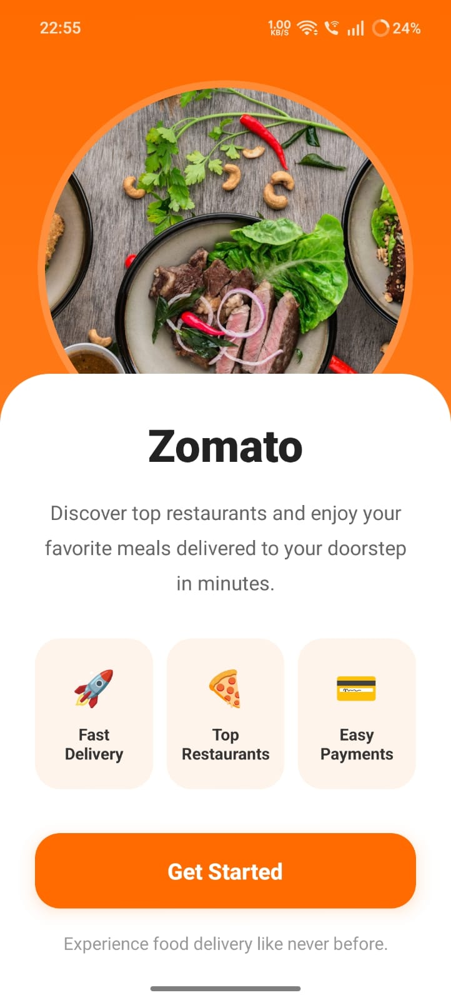
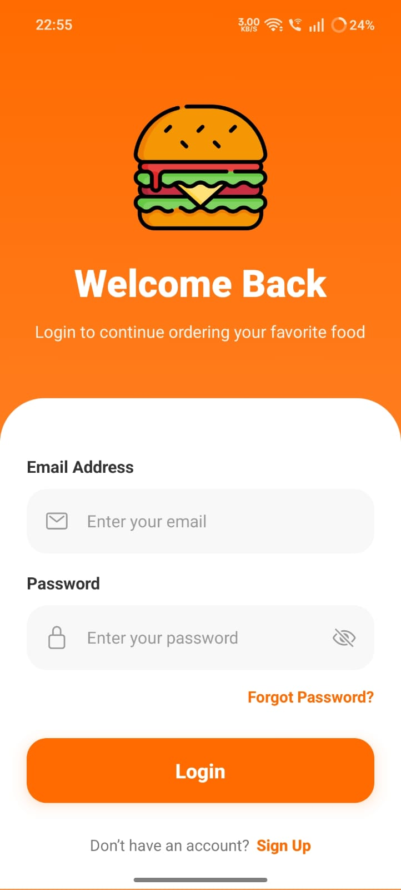
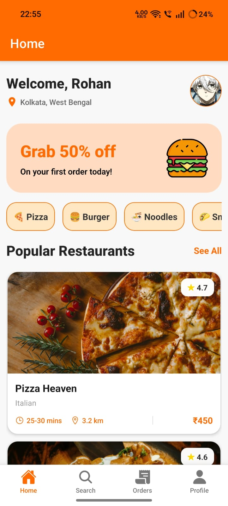
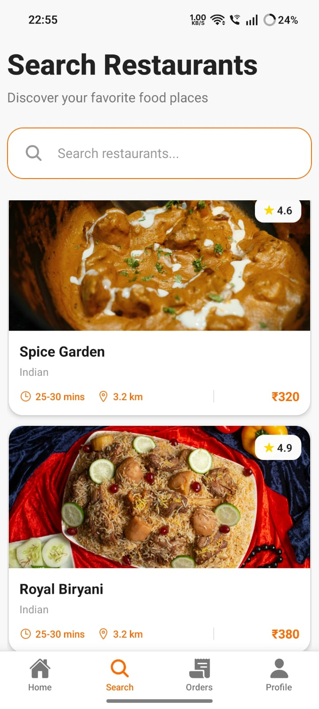
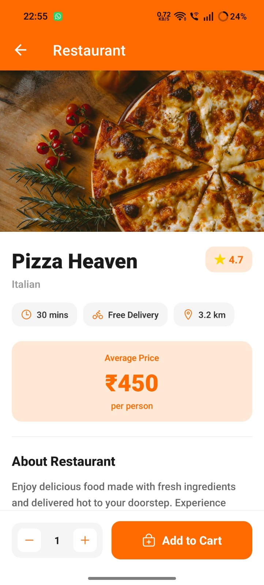
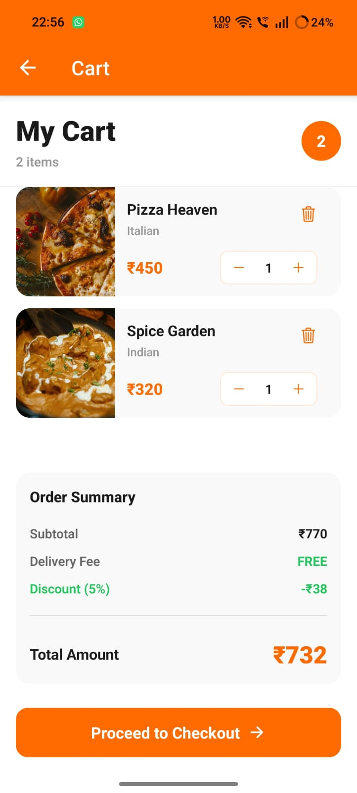
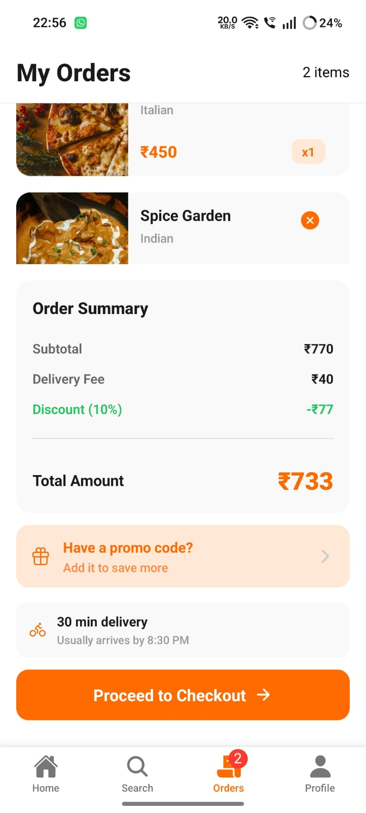
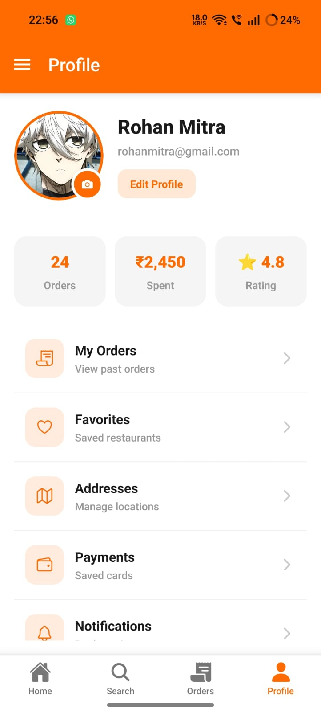
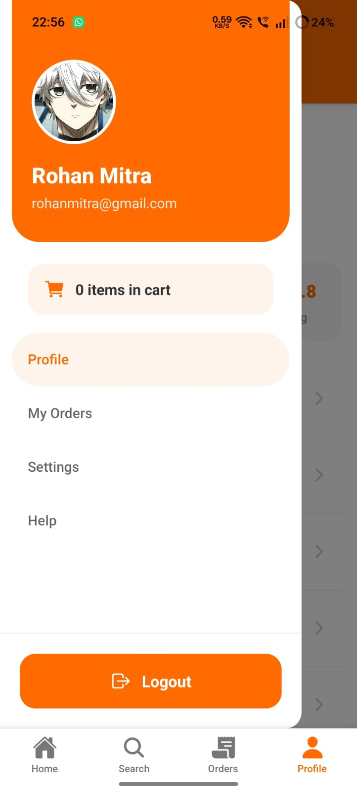
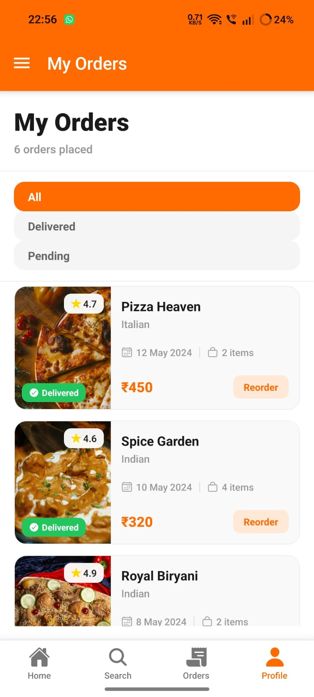
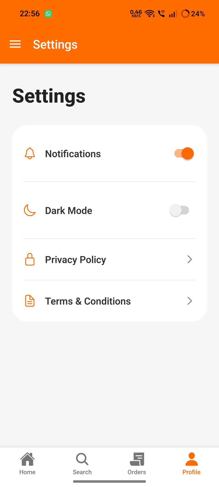
</p>


